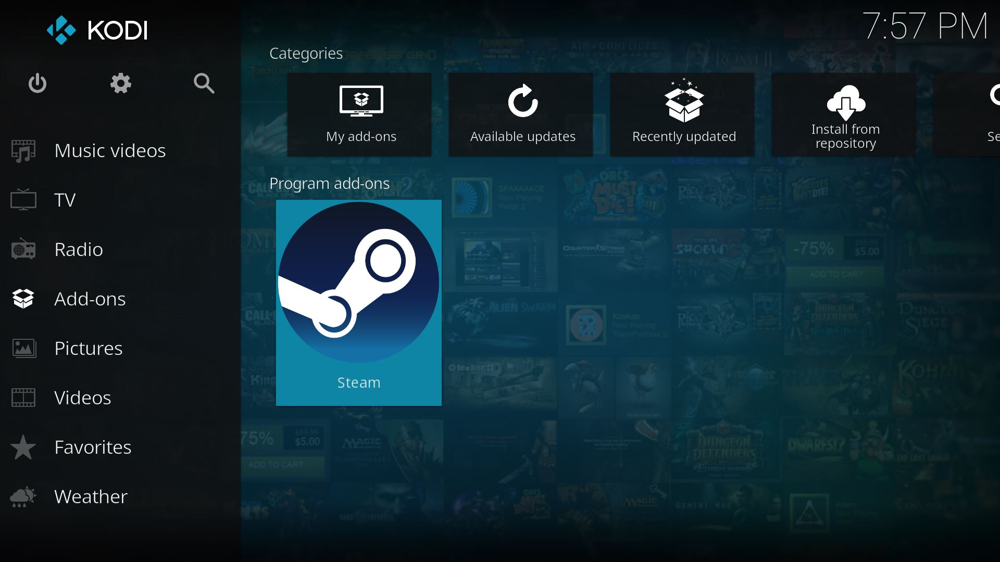
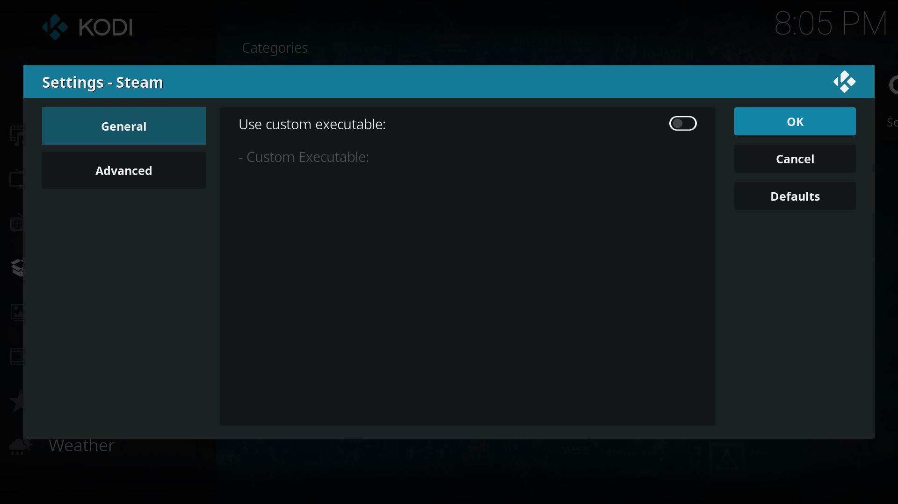
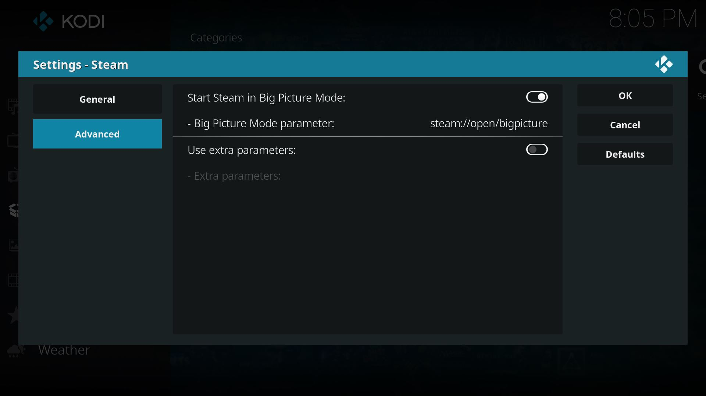

# Kodi Launches Steam Addon
Addon for Kodi to launch Steam on Windows, Linux and MacOS (platforms were Steam can be installed).

Our goal is to bring to Kodi an easy access to launch Steam in Big Picture Mode in order to have a better HTPC experience. Steam is the major online store for Windows, MacOS and Linux games and their related media. It also offers multiplayer and cross-platform gaming, in-home streaming, cloud saving, in-game voice and chat, achievements, VR, mods, hardware, devices and a huge and active gaming community.

This Addonn was made for Kodi Krypton v17.x and higher since it takes advantage of new features introduced on this version.

## What makes this addon different than others of the same kind?
- Completely open source, hosted on [GitHub](https://github.com/BrosMakingSoftware/Kodi-Launches-Steam-Addon) and published under GPL v3 license
- Created for Kodi v17 (Kripton or higher) and following  [Addon Rules](http://kodi.wiki/view/Add-on_rules)
- Multi-platform, works for Windows, Linux and MacOS
- Usage of hi-res icons and images based on latest official resources
- To find Applications/Programs paths, this addon relies on default environment variables, which exist on all operating systems. No _"registry-hack"_ programs are used for this purpose
- No 3rd-party libraries from unknown sources or with confusing distribution licenses are used. Actually no compiled libraries/programs/binaries are required at all for this addon to work. What you see on this repository is exactly what you need to run the addon. All code is made on Python and all sources are available
- Respects your privacy by not collecting any kind of hardware/software information, usage statistics or any kind of data from you or your system

## Usage
Use this Addon on Kodi if you want to launch Steam from it using a nice interface created with original images taken from the program itself. It works on any platform where Kodi and Steam can be installed (Windows, Linux and MacOS).

**Notes:**  
This Addon is just a launcher, so it assumes that you already have installed and configured Steam on your system. It will not assist you to install or configure Steam or download games for it. This Addon does not collect any kind of hardware/software information, usage statistics or any kind of data from you or your system, we respect your privacy, but we can't say the same for Steam since by its nature, it is a closed software. If you have any concern about your privacy, please read the official statements from Valve regarding this before the installation of Steam.

## Installation

#### Prerequisites
First, you need to install Kodi, to download and install it go to https://kodi.tv/  
After that you need to install and configure Steam, to download Steam go to http://store.steampowered.com Configuration of Steam is pretty straightforward, you will need to create a user account or login with an existing one, Steam assists you to do it.

#### Steps
1. Download the Addon:   
   For now this Addon is not registered on any official or unofficial Kodi repositories yet, hopefully it would be in the future. For now the way to install this Addon is to install it from a zip file.  
   Go to this page https://github.com/BrosMakingSoftware/Kodi-Launches-Kodi-Addon/releases and download the latest zip file available.

2. Start Kodi and navigate to `Settings -> Add-ons -> Add-on browser -> Install from zip file`, on the file browser look for the zip file you downloaded on the previous step and select it. Installation is going to start and Kodi will show a notification when this is done.   
   **Note:** If preference is not checked, Kodi will ask you to allow installations from zip files as a security measure. Change your preferences to allow installations from zip files and continue with the installation. Also please notice that this options can be displayed on different paths depending of the Skin you are using. The path used above is a generic one that may or may not be on your Skins, but in any case it is not hard to find.

3. Once the Addon is installed, navigate to `Program Add-ons` and you will see Steam listed there.   

   

4. Run the Addon, it will automatically look for the Steam executable based on the default programs folders of your operating system. You don't need to worry about the volume of the installation, if the folder name is localized to a different language than English (like in Windows) or your user home directory name (like in MacOS), the Addon will find it if it was installed on one of the default locations for programs.

  But, if the Addon cannot find the Steam executable, a pop up is displayed with instructions about how to specify a custom executable location (if that's your case), on the Addon-Settings you can turn on `Use custom executable` setting and select the executable on the setting below.

5. If you need to check the Addon-Settings, you can do it by selecting the Steam Addon, bringing up the contextual menu by right-clicking it (or pressing the `Guide` button on a remote, pressing `C` key on a keyboard, pressing `X` button on Xbox or Steam Controllers or `Square` button on PlayStation controllers) and selecting `Settings` or `Configure`.

   

   The next window will show you the Addon Settings divided on two tabs, `General` tab (as displayed above) contains the Custom Executable settings, and `Advanced` tab (as displayed below) contains the Steam Parameters Settings. If you ever need to start Steam using a special [parameter](https://developer.valvesoftware.com/wiki/Command_Line_Options#Command-line_parameters_3 "Steam Command-line parameters"), this is the place where you need to add it.

   

6. Enjoy!
